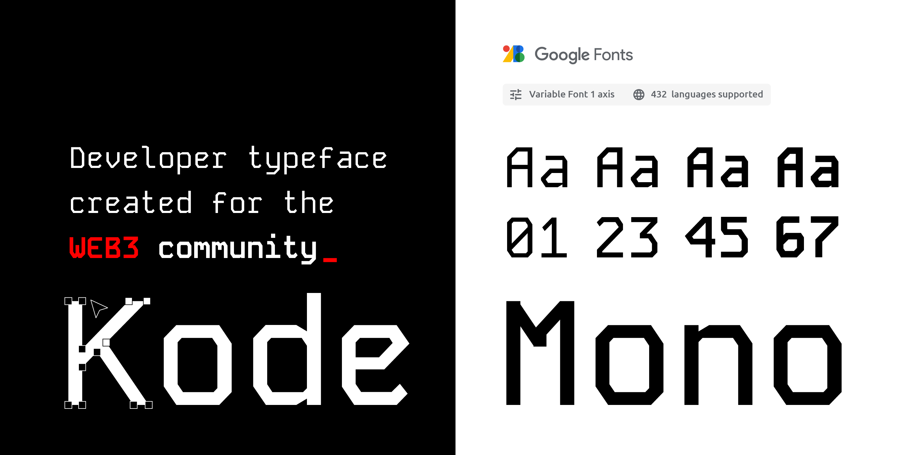
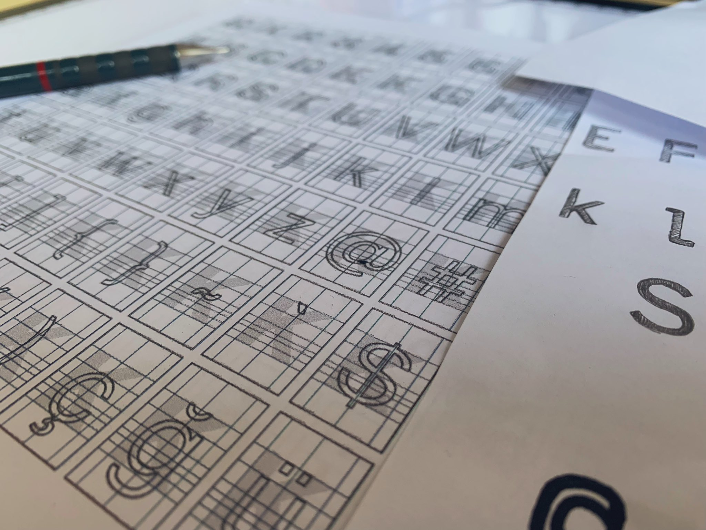

# Kode Mono

[![][Fontspector]](https://isaozler.github.io/kode-mono/fontspector/fontspector-report.html)
[![][Universal]](https://isaozler.github.io/kode-mono/fontspector/fontspector-report.html)
[![][GF Profile]](https://isaozler.github.io/kode-mono/fontspector/fontspector-report.html)
[![][Outline Correctness]](https://isaozler.github.io/kode-mono/fontspector/fontspector-report.html)
[![][Shaping]](https://isaozler.github.io/kode-mono/fontspector/fontspector-report.html)

[Fontspector]: https://img.shields.io/endpoint?url=https%3A%2F%2Fisaozler.github.io%2Fkode-mono%2Fbadges%2Foverall.json
[GF Profile]: https://img.shields.io/endpoint?url=https%3A%2F%2Fisaozler.github.io%2Fkode-mono%2Fbadges%2FGoogleFonts.json
[Outline Correctness]: https://img.shields.io/endpoint?url=https%3A%2F%2Fisaozler.github.io%2Fkode-mono%2Fbadges%2FOutlineCorrectnessChecks.json
[Shaping]: https://img.shields.io/endpoint?url=https%3A%2F%2Fisaozler.github.io%2Fkode-mono%2Fbadges%2FShapingChecks.json
[Universal]: https://img.shields.io/endpoint?url=https%3A%2F%2Fisaozler.github.io%2Fkode-mono%2Fbadges%2FUniversal.json

Available at\

A custom-designed typeface explicitly created for the developer community. 

This typeface is designed to enhance the user experience and reflect our principles of functionality and timelessness.

## About

### Focus on Developer Experience

As a developer-focused platform, we are dedicated to providing a secure, scalable, and efficient infrastructure for decentralized applications, and this typeface is an extension of that commitment.

### Programming Ligatures

Kode Mono comes with a set of ligatures. Supporting a wide range of language-specific ligatures including our smart-contract language Pact, Javascript, Haskell, Rust and many more to come.

### Variable axes

| Axis | Tag | Range | Default |
|---|---|---|---|
| Weight | `wght` | 400 – 700 | 400 |
| Width | `wdth` | 75 (Condensed) – 125 (Expanded) | 100 |
| Roundness | `ROND` | 0 (sharp) – 100 (rounded) | 0 |

### Stylistic set 1 (`ss01`)

Alternates for **D**, **Q** and **8** (plus Ď, Đ, Ð) that are easier to tell apart from O, 0 and B, for identity documents (visual inspection zone), scanned text and OCR.

### Stylistic set 2 (`ss02`)

The previous `>=` and `<=` ligature shapes. By default these ligatures render as ≥ and ≤.

### Powerline

Includes the Powerline glyphs (U+E0A0–U+E0A2, U+E0B0–U+E0B3) for terminal prompts and status lines.

## Building

Fonts are built automatically by GitHub Actions - take a look in the "Actions" tab for the latest build.

If you want to build fonts manually on your own computer:

* `make build` will produce font files.
* `make test` will run [fontspector](https://github.com/fonttools/fontspector)'s Google Fonts quality assurance checks (install with `cargo binstall fontspector`).
* `make proof` will generate HTML proof files with [diffenator3](https://github.com/googlefonts/diffenator3) (install with `cargo binstall diffenator3`).

The proof files and QA tests are also available automatically via GitHub Actions - look at `https://isaozler.github.io/kode-mono`.

## Changelog
[See CHANGELOG.md](./CHANGELOG.md)

## License

This Font Software is licensed under the SIL Open Font License, Version 1.1.
This license is available with a FAQ at
https://openfontlicense.org/

## Repository Layout

This font repository structure is inspired by [Unified Font Repository v0.3](https://github.com/unified-font-repository/Unified-Font-Repository), modified for the Google Fonts workflow.

## Credits

**Type designer**\
Isa Ozler

**Special Thanks to**\
Randy Daal, John Wiegley, Andy Tang, Ashwin van Dijk, Rosalie Wagner, Emma Marichal, Marc Foley, Viviana Monsalve, and everyone else contributed to this typeface.
